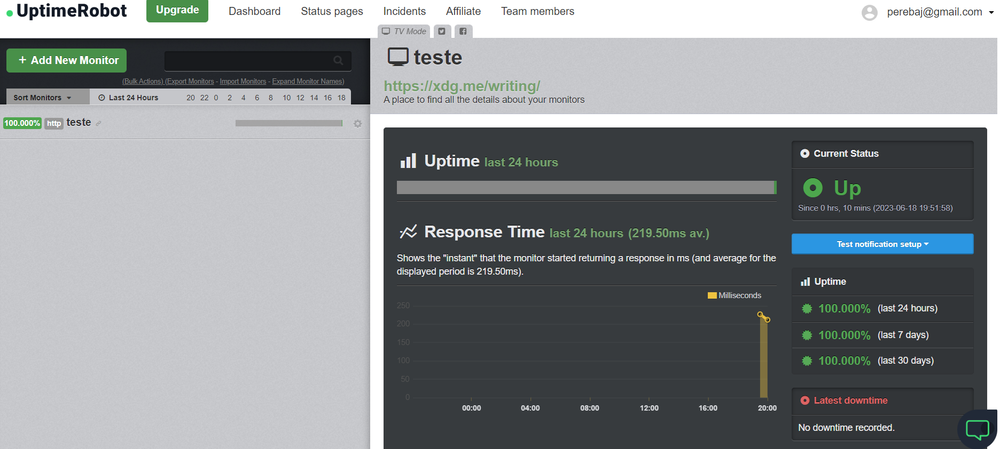
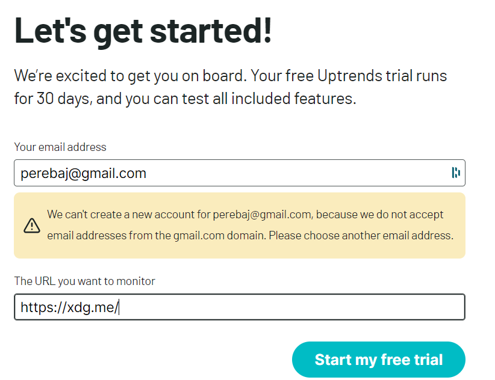
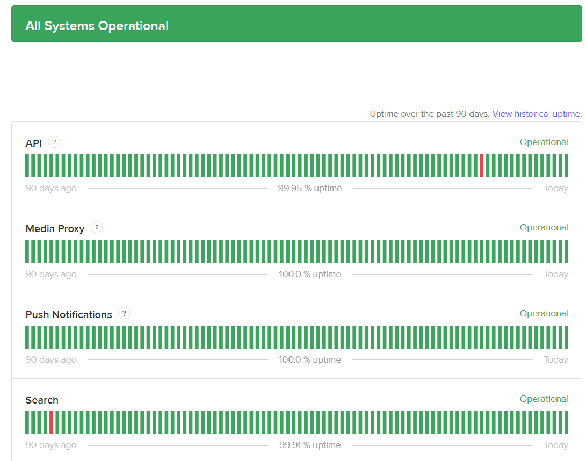

# Proposals

- I think that this product should be focused on developers that don't want to spend time building a status health page and for product managers that want to know if the principal flow of their product is working well

The differential with [other platforms](#market-examples) must be a perfect experience.

- Talking as a developer, I like solutions that allow using absolutely all features for a limited time(2 weeks), being possible to use it in a production environment, it is the better way to prove that product works. I think that this approach is a good one to win the heard of clients/developers and the community

- In my head should be something that delivers the first value in 3 clicks, like:
    - Login;
    - What enterprise/site do you represent?
    - Click here, we already have a status page for you!

- After the first value proof, we could start to show our main features, be the rigging of APIs, instrumentation of an important flow, etc...

- What do you think if we instrumented some user flow through some extension in the browser, the person executes the flow on his machine, while we are tracking all the routes that are being called

# Market Examples

- [uptimerobot](https://uptimerobot.com/)
- [Uptrends](https://www.uptrends.com/)

## Uptimerobot lacks:

The experience to monitor a simple route was terrible, seems to be a platform made by engineers for engineers, which is not a problem, but I imagined that what we want here is to build the opposite. A platform that made it easy for anyone to know how my product is going on.

## Uptrends lack:
I don't want to know anything about the project, just give me any way to confirm that it works and I will pay any value that you want

# The state-of-the-art design

[discord status page](https://discordstatus.com/)

I imagined that users don't care if the route: **POST jojo_is_aweasome/** is not working, I just want to know the number of flows that are working or not.

If the most important flow for a site is to guarantee that users can log in or add an item in the shopping car I imagined that we must make available a tool that gives that!
